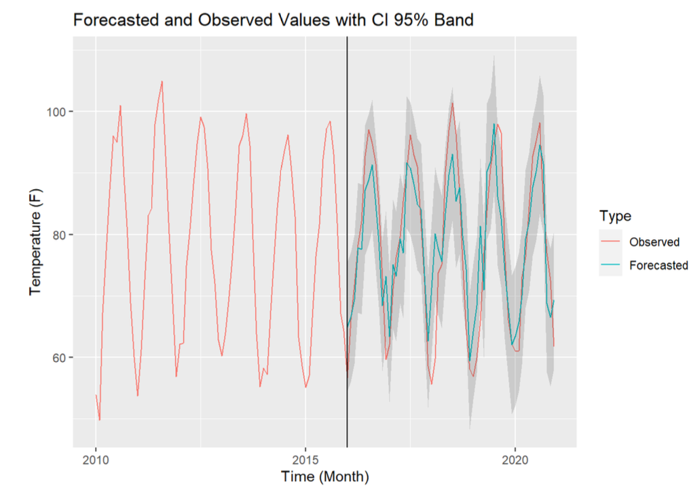

## Selected Projects in Data Science and Analytics

---

### NLP - Analyzing and Improving ELECTRA Performance on Neutrally Labeled Premise/Hypothesis Pairs 

<!-- Hate speech detection is the automated task of determining whether a piece of text contains hateful content. In this project, I built a classifier using PyTorch to fine-tune a BERT model. -->

Pre-trained models that over-rely on popular annotated datasets, like SNLI and MNLI, can learn dataset specific "Artifacts". This hinders model generalization and leads to poor performance when deployed to production. In this paper, I build, train, analyze, and improve model performance on neutrally labelled Premise/Hypothesis pairs using the ELECTRA-Small model and HuggingFace Transformers library.

[Read the Paper Here](https://www.google.com/)

---

### Devops - Modern Data Analytics Stack In a Box (Pyspark, Apache Superset, Duckdb) 

With advances in hardware and the profileration of more advanced open source software, processing data what used to be 
"Big Data" no longer requires a complicated cluster of machines. In this project, I use Docker to setup DuckDB + Apache Superset 
for quick, no-cost analytics on datasets that can fit on local hardware. I also include a PySpark docker container, which I've used
to train teams at Amazon on the internals of PySpark and Docker.

[PySpark Stack](https://github.com/mathew-wai-lee/docker_pyspark_unix_devcontainer) | 
[Duckdb Superset Stack](https://github.com/mathew-wai-lee/docker_compose_superset_devcontainer)

---

### Deep Learning - Teaching AI to Play SuperTuxCart

CNN (Convolutional Neural Networks) can do amazing things when paired with clever software design.
In this project, I created a low-level controller to train an AI cart to complete a course of SuperTuxKart.
The 'auto-pilot' control mechanism is then used auto-pilot to train a vision based driving system composed of a CNN.

[Code](https://www.google.com/)

---

### Time Forecasting - Using SARIMA to Predict Dallas Weather 

SARIMA (Seasonal Auto Regressive Integrated Moving Average) brings components of different Time Series forecasting methods
to create a more robust way to forecast. In this assignment, I report the "one-year-in-advance" prediction of aMDT for January 2018, 
along with the upper and lower bounds of the prediction interval. 

