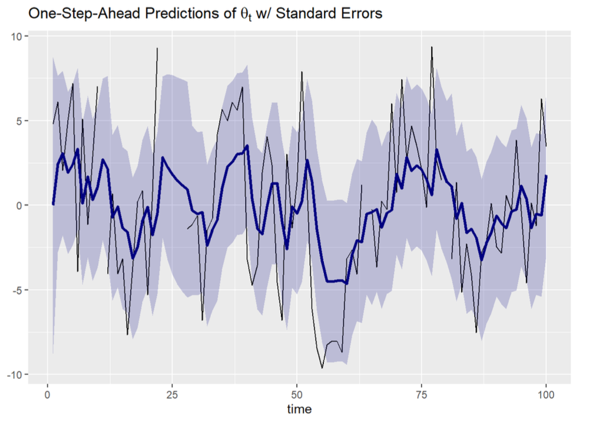
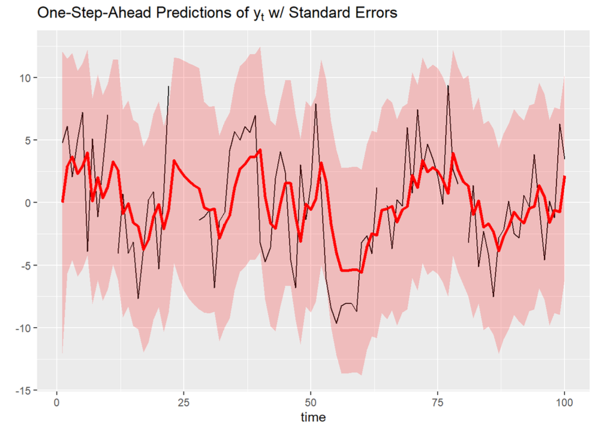
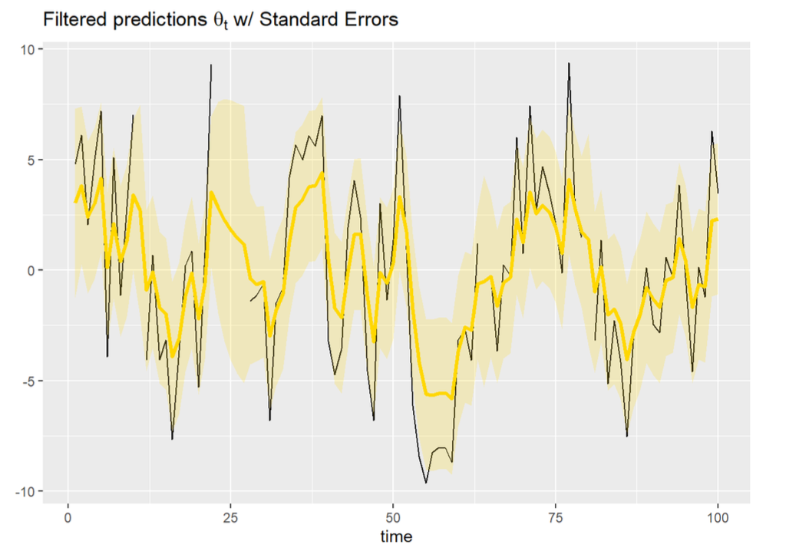
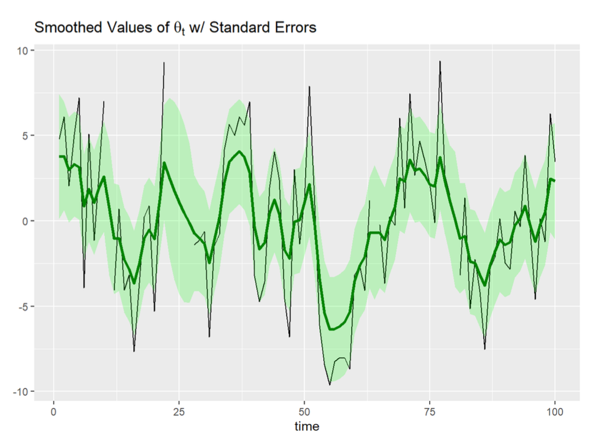
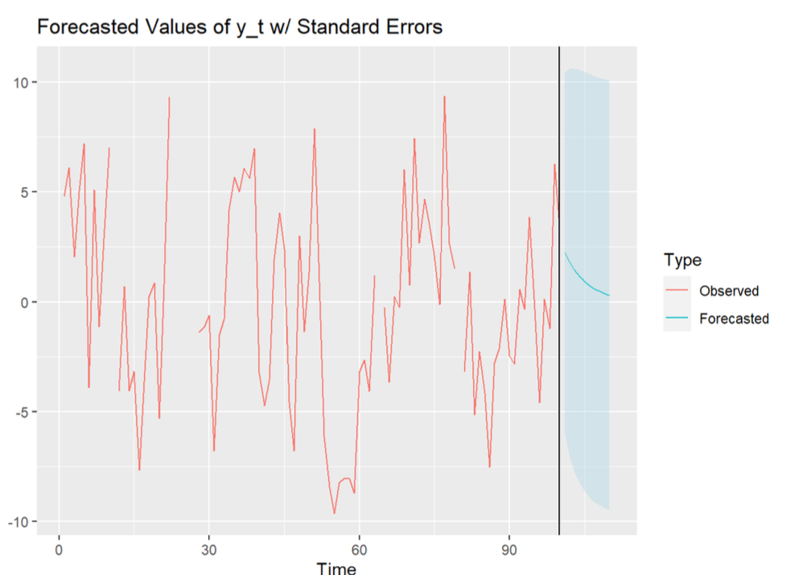

## Selected Projects in Data Science and Analytics

---

### NLP - Analyzing and Improving ELECTRA Performance on Neutrally Labeled Premise/Hypothesis Pairs 

Pre-trained models that over-rely on popular annotated datasets, like SNLI and MNLI, 
can learn dataset specific "Artifacts". This hinders model generalization and leads to 
poor performance when deployed to production. In this paper, I build, train, analyze, 
and improve model performance for identifying neutrally labelled Premise/Hypothesis pairs using the ELECTRA-Small model 
and the HuggingFace Transformers library.

[Read the Paper Here](https://github.com/mathew-wai-lee/mathew-wai-lee.github.io/blob/gh-pages/docs/assets/papers/Analyzing%20and%20Improving%20ELECTRA%20Performance%20on%20Neutrally%20Labeled%20Premise-Hypothesis%20Pairs.pdf)

---

### Deep Learning - Teaching AI to Play SuperTuxCart

CNN (Convolutional Neural Networks) are a type of feed-forward deep neural network that leverages 
convolution layers for visual processing. CNN's can do amazing things when paired with clever software design!
In this project, I leverage a low-level 'auto-pilot' controller to train an AI vision based driving system 
to complete a course of SuperTuxKart.

[Find the Code Here](https://www.google.com/)

---

### Devops - Modern Data Analytics Stack In a Box (Pyspark, Apache Superset, Duckdb) 

With advances in hardware and the profileration of more advanced open source software, processing data what used to be 
"Big Data" no longer requires a complicated cluster of machines and a PhD. In this project, I use Docker to setup DuckDB + Apache Superset 
for quick no-cost analytics on datasets that can fit on local hardware and be deployed on any laptop. 
I also include a PySpark docker container, which I've used to train teams at Amazon on the internals of PySpark and Docker.

[PySpark Stack](https://github.com/mathew-wai-lee/docker_pyspark_unix_devcontainer) | 
[Duckdb Superset Stack](https://github.com/mathew-wai-lee/docker_compose_superset_devcontainer)

---

### UI/UX Application Development - Develop Business Friendly Tools

Most business stakeholders err away from using CLIs (Command Line Interfaces) or from writing complicated SQL. 
Instead, I designed and built an application that accepts input, queries a MS SQL Server Database, 
and returns results for master data management teams to maintain tables in SAP.

[Application Code Here](https://github.com/mathew-wai-lee/PCUIGo) |
[Golang Todo App Here](https://github.com/mathew-wai-lee/todo_app_golang) 

---

### Time Forecasting - Using SARIMA to Predict Dallas Weather 

SARIMA (Seasonal Auto Regressive Integrated Moving Average) is a widely used model that brings components of 
different Time Series forecasting methods to create a more robust way to forecast. 
In this assignment, I report the "one-year-in-advance" prediction of temperature for January 2018, 
along with the upper and lower bounds of the prediction interval. 

[Find the Code Here](https://www.google.com/)

---

### Kalman Filter - Applying a Kalman Filter to univariate dynamic linear model time series

Kalman Filters have many applications in aerospace, navigation, econometrics, etc. and is often applied in
time series analysis for signal processing. By recursively using "predict" and "update" stages, we are able to 
estimate a joint probability distribution over the variables by taking the uncertainty into account. In this assignment, I apply the 
Kalman filter for forecasting a time series.

[Find the Code Here](https://www.google.com/)

|                                                        |                                                | 
|:-------------------------------------------------------|:-----------------------------------------------|
|           |   |
|           |   |

